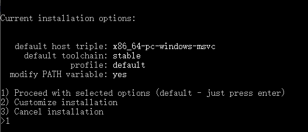
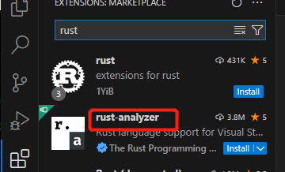
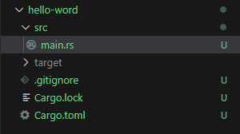

# rust

## 1. 开始

### 1.1. 安装rust

Windows下安装rust

1. 安装c++环境[Microsoft C++ Build Tools](https://visualstudio.microsoft.com/zh-hans/visual-cpp-build-tools/)

2. 安装[RUSTUP-INIT](https://www.rust-lang.org/learn/get-started)

   

选择1默认安装，结束会显示安装完成。

3. 检查是否安装成功

   ```powershell
   > rustc -V
   rustc 1.81.0 (eeb90cda1 2024-09-04)
   
   > cargo -V
   cargo 1.81.0 (2dbb1af80 2024-08-20)
   ```

   rustc: rust编译器

   cargo: rust包管理器 

### 1.2. vscode编辑器插件

rust-analyzer: 对rust的语法支持



### 1.3. 第一个程序

```
> cargo new hello-world
```

利用cargo包管理工具创建第一个hello-world项目

目录结构如下：



运行

```
> cargo run
```


